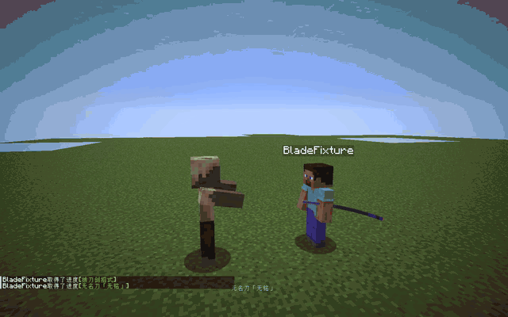

# SlashBlade:Re

**English** · [简体中文](README.zh-CN.md)

## A familiar blade. A new flow.

SlashBlade:Re brings SlashBlade to **Minecraft 26.1.2 on NeoForge**, with reworked katana movement from the first draw to the final sheathe.

Chain your cuts. Time your Slash Arts. Feel the motion carry through your hands, your blade, and your view.

**[Get started ↓](#get-started)** · [Controls](#make-your-first-cut) · [Build from source](#build-from-source) · [Report an issue](https://github.com/Viking602/SlashBlade-Re/issues)

> **Development preview · `0.1.2-26.1.2-port.27`**<br>
> This repository provides source code. Build the preview below; a packaged release is not published here yet.

**[port.27: all eight Slash Arts in first person](media/resharped-first-person.mp4)** — normal combos, each SA, Just SA and Super SA against one training Husk, with real damage and no healing.



**[Watch the full combat showcase](media/combat-showcase.mp4)** · [First-person recording](https://cdn.jsdelivr.net/gh/Viking602/SlashBlade-Re@7bf343ad5039dfab8b6275542618887e4e8f2b81/media/first-person-combat.mp4) · [Original-motion comparison](media/first-person-original.mp4)

*Fresh, continuous gameplay: normal and extended combos, standard SA, Just SA, and Super SA, including recovery and sheathing. The stationary training Husk has extra health; the display shows actual damage, with no healing during the recording. Videos run at original speed and have no audio.*

## Every cut, connected.

**Draw. Cut. Return.**<br>
The blade clears its sheath before the cut. Recovery flows into alignment and sheathing. The saya rests at your side and follows your body.

**Your whole body moves.**<br>
Hips lead. Shoulders turn. Elbows and wrists bend. Hands, hilt, and sheath share a coordinated rig, with original choreography inspired by iaido and the pace of Devil May Cry.

**Original cuts. A clearer first-person view.**<br>
First person restores SlashBlade's original VMD blade and saya tracks. Quick cuts keep their authored timing; a brief, shared transition settles the weapon pair when a combo is interrupted. No hands, arms, or sleeves obstruct the view, and the resting hilt stays visible.

Both views share the action clock and katana size. Third person uses the articulated character rig; first person uses the original weapon tracks, so their paths differ. Like Resharped, attacks animate the weapon without adding head-follow rotation to the world camera.

Item tooltips follow Resharped's field order, colors and visibility rules. Inventory icons use its authored rotation, scale and durability ring. If RarityCore is installed, its extra rarity labels and name recoloring are skipped for SlashBlade items.

[View the tooltip](media/resharped-tooltip.png) · [View all blade icons](media/resharped-icons.png)

**SlashBlade, carried forward.**<br>
Ground and air combos, Slash Arts, Just SA, and Super SA join the familiar blades, crafting progression, soul materials, and summoned swords. English and Simplified Chinese are built in.

**Grow your blade along Resharped’s routes.**<br>
Adapted from the actual [SlashBlade: Resharped 1.9.65 source](https://github.com/0999312/SlashBlade_Resharped/tree/6e2a0a092fb794d7ea56fd83452869674f3ab1c7), this build includes **5 base items and 26 named definitions (including broken/sealed variants)**, **23 crafting upgrades, 1 netherite smithing upgrade, 6 soul-material recipes and 6 blade-stand recipes**. JEI distinguishes the blade variants; hover a required blade to read its growth thresholds.

Upgrades keep kills, ProudSoul, refine, compatible enchantments, custom names, ownership and blade identity. Previously saved base blades remain usable in upgrades. Old material-box shortcuts, duplication recipes and activated/awakened souls leave normal progression; their existing item IDs remain loadable.

**Resharped gameplay, rebuilt for NeoForge.**<br>
All eight built-in Slash Arts now execute their own attacks. Blade stands can transfer arts, extract and install special effects, and apply enchanted souls. Growth, drops, self-repair, damage and resource costs use the reference rules with server settings. Existing named blades receive their matching art/effect metadata once, preserving later customizations.

### Choose your Slash Art

| Art | What it does |
| :--- | :--- |
| Judgement Cut | A targeted cut, with precise-release and Super SA variants. |
| Sakura End | A two-part crossing slash, with ground and air sequences. |
| Void Slash | A delayed burst after the draw. |
| Circle Slash | Successive cuts around the wielder. |
| Drive — Vertical | A vertical flying slash. |
| Drive — Horizontal | A horizontal flying slash. |
| Wave Edge | A moving, multi-hit blade wave. |
| Piercing | A forward thrust, with a precise-release variant. |

Put a blade on a stand, then left-click the stand with an **SA-bearing Sphere** to install its art. An enchanted Tiny ProudSoul can copy the blade’s SA when the same enchantment is at maximum on the blade. Use an **SE-bearing Crystal** to install an effect; a blank Crystal extracts a removable, copiable effect. These item variants appear separately in creative inventory and JEI.

The reference’s built-in SE, **Wither Edge**, requires **20 experience levels**. At that level it inflicts Wither on melee hits; below it, holding the blade inflicts Wither on the wielder. Enchanted souls also apply enchantments on a blade stand, using the reference’s tiered success chances and consuming the material.

### Tune your world

Server settings live in the world’s `serverconfig/slashblade-server.toml`. They cover PvP and friendly targets (both disabled by default), repair costs, soul drops, summoned-sword costs, refine limits, rusty-blade spawns, and damage multipliers. Client and server share these settings.

Blade definitions and entity drops are synced data-pack registries. Use `data/<namespace>/slashblade/named_blades/<name>.json` and `data/<namespace>/slashblade/entity_drop/<name>.json`; the bundled data supplies all **26 named definitions and 6 entity-drop rules** from the reference. Crafting remains under the modern singular `recipe` directory.

**Compatibility:** the built-in Resharped content and systems are adapted to this version. Its Forge 1.20.1 add-ons, EMI/Patchouli integration, and optional renderer bridges are not binary-compatible ports. JEI and the animation system are integrated here. Twilight Forest drops require matching entities from a compatible installation. Cross-version Forge save migration remains unverified.

## Start with a wooden blade

The main path is **Wooden Sword → Wooden Blade → White Sheath → Broken White Sheath → unnamed SlashBlade**. The other branch is **Wooden Blade → Bamboo → Silver Bamboo → Broken Silver Bamboo → Ruby → White/Black Fox**. Normal use wears the blade: Wood and Bamboo are destructible; White and Silver Bamboo leave a broken blade. Sealed broken blades require their specific repair recipe.

Requirements are minimum progress on the input blade, not points consumed by upgrading. Use the recipe book or JEI for the exact grid.

| Target | Materials and requirements |
| :--- | :--- |
| Anonymity -Wood- | Craft: 2 × log, 1 × wooden sword. |
| Anonymity -Bamboo Light- | Craft: 2 × bamboo, 1 × Anonymity -Wood-. |
| Noted -Silver Bamboo Light- | Craft: 1 × egg, 1 × iron ingot, 2 × string, 1 × Anonymity -Bamboo Light-, 1 × black dye, 1 × paper. |
| Sharpness -White- | Craft: 2 × Blade Soul Ingot, 1 × Anonymity -Wood-, 1 × gold ingot. |
| Anonymity -Nameless- | Craft: 1 × blaze rod, 2 × gold ingot, 1 × blue dye, 1 × Sharpness -White-, 1 × coal block, 1 × string. Required blade: broken. |
| Sharpness -nameless- Ruby | Craft: 1 × red dye, 2 × Blade Soul Ingot, 1 × Proud Soul, 1 × Noted -Silver Bamboo Light-, 1 × string. Required blade: broken. |
| -Haze- SakuraFox | Craft: 1 × obsidian, 1 × feathers, 1 × blaze powder, 1 × Sharpness -nameless- Ruby, 1 × Blade Soul Crystal, 1 × crops wheat, 1 × quartz block. Required blade: smite 1. |
| -Weiss- SakuraFox | Craft: 1 × obsidian, 1 × feathers, 1 × blaze powder, 1 × Sharpness -nameless- Ruby, 1 × Blade Soul Crystal, 1 × crops wheat, 1 × quartz block. Required blade: looting 1. |
| -Chizuru- Muramasa | Craft: 8 × Blade Soul Sphere, 1 × Anonymity -Nameless-. Required blade: ProudSoul ≥ 10,000; refine ≥ 20. |
| Noble -Tukumo- Violet | Craft: 1 × emerald block, 2 × Blade Soul Sphere, 1 × diamond block, 1 × redstone block, 1 × Anonymity -Nameless-, 1 × lapis block, 1 × iron block, 1 × gold block. Required blade: fire aspect 1. |
| Ironwood -Tagayasan- | Craft: 4 × Blade Soul Sphere, 2 × ender eye, 2 × ender pearl, 1 × Anonymity -Wood-. Required blade: ProudSoul ≥ 1,000; refine ≥ 10; unbreaking 1. |
| Sabigatana | Zombies can spawn carrying this blade (5% × local difficulty multiplier, within the 15% blade-carrying pool). It can also be repaired from the broken, sealed variant with 2 ProudSoul Ingots. Normal equipment-drop rules apply. |
| Steel -Doutanuki- | Craft: 2 × Blade Soul Sphere, 1 × Sabigatana. Required blade: kills ≥ 100; ProudSoul ≥ 1,000; refine ≥ 10. |
| -Agito- | Craft: 4 × Proud Soul, 1 × Rust -Agito-. Required blade: kills ≥ 100. |
| -Agito- | Craft: 4 × Proud Soul, 1 × Rust -Agito-. Required blade: kills ≥ 100. |
| -Orotiagito- | Craft: 4 × Proud Soul, 4 × Blade Soul Sphere, 1 × -Agito-. Required blade: kills ≥ 1,000; ProudSoul ≥ 1,000; refine ≥ 10. |
| Yamato | Craft: 8 × Blade Soul Sphere, 1 × Yamato. Required blade: broken; sealed. |
| -Wooden- Rodai | Craft: 1 × Blade Soul Crystal, 1 × Noted -Silver Bamboo Light-, 1 × wooden sword, 1 × string. Required blade: kills ≥ 100; broken. |
| -Stone- Rodai | Craft: 1 × Blade Soul Crystal, 1 × Noted -Silver Bamboo Light-, 1 × stone sword, 1 × string. Required blade: kills ≥ 100; broken. |
| Named -Steel- Rodai | Craft: 1 × Blade Soul Crystal, 1 × Noted -Silver Bamboo Light-, 1 × iron sword, 1 × string. Required blade: kills ≥ 100; broken. |
| Named -Golden- Rodai | Craft: 1 × Blade Soul Crystal, 1 × Noted -Silver Bamboo Light-, 1 × golden sword, 1 × string. Required blade: kills ≥ 100; broken. |
| Named -Diamond- Rodai | Craft: 1 × Blade Soul Trapezohedron, 1 × Noted -Silver Bamboo Light-, 1 × diamond sword, 1 × string. Required blade: kills ≥ 100; broken. |
| Named -Netherite- Rodai | Craft: 1 × Blade Soul Trapezohedron, 1 × Noted -Silver Bamboo Light-, 1 × netherite sword, 1 × string. Required blade: kills ≥ 100; broken. Alternatively, smith Diamond Rodai with a Netherite Upgrade Template and a Netherite Ingot; progress is retained. |

### Find blades through combat

| Blade | Acquisition |
| :--- | :--- |
| Sabigatana (broken/sealed) | Unarmed zombies can receive a blade on spawning: 5% × difficulty intact, the next 10% broken and sealed. Drowned and zombified piglins are excluded. |
| Yamato (broken/sealed) | Defeat the Ender Dragon. Broken, sealed Yamato drops at (0, 60, 0) in the End. Repair it with 8 ProudSoul Spheres. |
| Sange | Defeat a Wither while holding a SlashBlade: 30% drop chance, +10 percentage points per Looting level. |
| koseki | Place an unnamed basic SlashBlade on a blade stand and let a Wither explosion strike the stand. |
| Rust -Agito- | Requires Twilight Forest: Naga drops it at 30%, +10 percentage points per Looting level. No substitute crafting recipe. |
| Rust -Agito- | Requires Twilight Forest: Hydra drops it at 30%, +10 percentage points per Looting level. No substitute crafting recipe. |
| Yasha | Requires Twilight Forest: defeat a Minotaur while holding a SlashBlade. 5% drop chance, +10 percentage points per Looting level. |
| Yasha -Kikouku- | Requires Twilight Forest: defeat a Minoshroom while holding a SlashBlade. 20% drop chance, +10 percentage points per Looting level. |

### Souls and refining

Broken blades drop Tiny ProudSouls. Convert 4 Tiny ProudSouls into 1 ProudSoul, then combine 2 ProudSouls with 1 Iron Ingot for a ProudSoul Ingot. Smelt the Ingot into a Sphere (200 ticks); blast the Sphere into a Crystal (300 ticks), then the Crystal into a Trapezohedron (400 ticks). Crafting conversions retain a single kind of level-I enchantment; mixed enchantments and higher levels are rejected.

By default, each anvil refine costs **1 material and 1 experience level**, restores durability and adds ProudSoul as below. Maximum durability grows by one for each of the first 200 refines. At a material’s refine cap, it can repair but cannot generate further ProudSoul.

| Material | Refine cap | ProudSoul per refine |
| :--- | ---: | ---: |
| Tiny Proud Soul | 10 | 100 |
| Proud Soul | 50 | 500 |
| Blade Soul Ingot | 100 | 1,000 |
| Blade Soul Sphere | 150 | 1,500 |
| Blade Soul Crystal | 200 | 2,000 |
| Blade Soul Trapezohedron | 2,147,483,647 | 5,000 |

With default server settings, kills grant ProudSoul from dropped experience and style rank, capped at 100 per award. A summoned sword costs 2; a formation costs 20. Standard SA spends 20 when available, otherwise one durability point. Super SA retains this build’s rules below.

## Get started

| You need | Version |
| :--- | :--- |
| Minecraft | **26.1.2** |
| NeoForge | **26.1.2.114** — tested baseline |
| Java | **25** |
| SlashBlade:Re | The same build on client and server |

1. [Build the mod](#build-from-source) to obtain the JAR.
2. Install NeoForge for Minecraft 26.1.2, then place the JAR in your instance's `mods` folder. Keep only one SlashBlade JAR installed.
3. Start with a new test world. Find the blades in the SlashBlade creative tab, or follow the in-game advancements and recipes in survival.

The animation system runs inside this mod. **Epic Fight and PlayerAnimator are not required.** Existing Forge 1.20.1 worlds and third-party SlashBlade add-ons have not been validated for this port.

## Make your first cut

| Action | Default input |
| :--- | :--- |
| Attack / continue a combo | Left click |
| Draw attack | Tap right click |
| Slash Arts (SA) | Hold right click to charge, then release |
| Just SA | Release in the precision window — normally ticks 9–11 |
| Super SA | Hold **V** for at least one second, then release |

Super SA requires an eligible enchanted blade with at least **1,000 kills**, full durability, and no broken or sealed state. It consumes **50% durability**. **V** can be rebound in Controls.

## Built. Played. Compared.

`port.27` passes **132 required GameTests**: progression, inheritance, soul economy, acquisition, blade-stand transactions, special effects, configuration, registries, and actual damage from all eight Slash Arts. Client checks run in an isolated instance with **205 installed mods**, including RarityCore. Tooltip checks cover display conditions and compatibility; icon checks compare actual rendered bounds with Resharped's OBJ geometry and GUI transform.

The renderer checks compare first-person geometry with the original VMD tracks, including Piercing; test interruption and sheathing transitions; and sample both hands, head turns and look angles. Third-person tests exercise the character rig and actual entity renderer. First person submits no arm geometry.

The combat fixture releases SA through the item’s server-side charge handler and records a Husk’s actual health loss. It does not heal the target during recording. These checks cover built-in content; custom model proportions, other animation mods and long multiplayer sessions still need separate testing. A wide swing can briefly carry the blade outside the frame.

## Build from source

Install a **JDK 25** and use the included Gradle wrapper. The first build downloads its dependencies.

```sh
git clone https://github.com/Viking602/SlashBlade-Re.git
cd SlashBlade-Re
```

**Windows (PowerShell)**

```powershell
.\gradlew.bat build
```

**macOS / Linux**

```sh
sh ./gradlew build
```

Output: `build/libs/SlashBlade-26.1.2-0.1.2-26.1.2-port.27.jar`.

To run the server-side regression suite, use the same wrapper with `runGameTestServer` in a disposable checkout. The task writes to a sibling `test-gametest` directory.

## Help shape the next cut

[Open an issue](https://github.com/Viking602/SlashBlade-Re/issues) with your Minecraft, NeoForge, and mod versions, steps to reproduce, and the relevant log. For animation issues, include the blade, dominant hand, camera view, and a short recording if possible.

## Credits & licensing

Based on [SlashBlade 2 by Furia / flammpfeil](https://github.com/flammpfeil/SlashBlade_2), through [Viking602/SlashBlade_2](https://github.com/Viking602/SlashBlade_2). NyMmd is by nyatla; the OBJ importer carries upstream Forge attribution. Existing author and license notices are preserved.

Blade progression, arts, effects, blade-stand interactions, server settings, and data-pack registries draw on [SlashBlade: Resharped by the M Mysterious Mountain Forging-shop Group](https://github.com/0999312/SlashBlade_Resharped/tree/6e2a0a092fb794d7ea56fd83452869674f3ab1c7). Its MIT notice is retained in the third-party notices. Eighteen blade model/texture files, the Drive model, and two Piercing motion files come from Resharped. They retain their original artwork terms and are not covered by this project’s MIT grant.

The MIT scope for original SlashBlade:Re contributions and the licenses of inherited code and assets are documented in [LICENSE](LICENSE) and [THIRD_PARTY_NOTICES.md](THIRD_PARTY_NOTICES.md). **The complete inherited project is not licensed under MIT.**

Epic Fight and Devil May Cry informed the animation direction. Their code and animation assets are not bundled; this is an independent community project.
