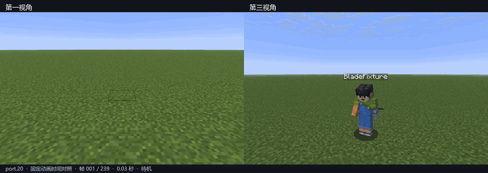

# 拔刀剑 重铸

[English](README.md) · **简体中文**

## 熟悉的拔刀剑。重新出鞘。

**SlashBlade:Re** 将拔刀剑带到 **Minecraft 26.1.2 / NeoForge**，重新编排从拔刀、挥斩到收刀的整套动作。

衔接连斩，把握时机，释放剑技。让双手、刀身与视线，随每一刀一起移动。

**[开始游玩 ↓](#开始游玩)** · [基础操作](#挥出第一刀) · [从源码构建](#从源码构建) · [反馈问题](https://github.com/Viking602/SlashBlade-Re/issues)

> **开发预览版 · `0.1.2-26.1.2-port.20`**<br>
> 当前仓库提供源码，可按下方步骤构建；暂未在此发布打包下载版。



*同一套动作，两种视角。八秒游戏实录对照，两侧使用相同动画帧。[观看 MP4](docs/media/perspective-comparison.mp4)。*

## 每一刀，都连贯。

**拔刀，挥斩，归鞘。**<br>
刀身完全离鞘，再切入挥斩。收势后寻鞘、对齐、纳刀，自然衔接。刀鞘佩在腰侧，跟随身体移动。

**动作，从全身发起。**<br>
转髋带肩，屈肘运腕。双手、刀柄与刀鞘由同一套骨骼约束协调，原创动作编排参考居合的出入鞘方式，以及《鬼泣》的战斗节奏。

**切换视角，动作依旧。**<br>
第一与第三人称共用角色姿态和武器挂点。第一人称镜头跟随头部动画，限制旋转幅度；实际瞄准方向仍由你掌握。

**熟悉的拔刀剑，继续向前。**<br>
地面与空中连招、SA、精准 SA、Super SA，以及刀剑、合成成长、魂系材料和幻影剑系统，在新版本中延续。内置英文与简体中文。

## 开始游玩

| 运行环境 | 版本 |
| :--- | :--- |
| Minecraft | **26.1.2** |
| NeoForge | **26.1.2.114**，当前验证基线 |
| Java | **25** |
| SlashBlade:Re | 客户端与服务端安装相同构建 |

1. 按[构建说明](#从源码构建)生成模组 JAR。
2. 安装 Minecraft 26.1.2 对应的 NeoForge，将 JAR 放入实例的 `mods` 文件夹。只保留一份拔刀剑模组。
3. 先在新建测试世界中体验。创造模式可从拔刀剑物品栏取刀；生存模式可跟随游戏内进度和配方开始成长。

动作系统由模组自身实现，**不需要安装 Epic Fight 或 PlayerAnimator**。尚未验证 Forge 1.20.1 旧存档直接升级，以及第三方拔刀剑附属的兼容性。

## 挥出第一刀

| 动作 | 默认操作 |
| :--- | :--- |
| 攻击／衔接连招 | 鼠标左键 |
| 拔刀攻击 | 短按鼠标右键 |
| 剑技 SA | 按住鼠标右键蓄力，随后松开 |
| 精准 SA | 在精准窗口内松开，基础窗口为第 9–11 tick |
| Super SA | 按住 **V** 至少一秒，再松开 |

Super SA 需要满足妖刀条件的附魔刀：击杀数至少 **1,000**、满耐久、未断刀且未封印。释放会消耗 **50% 耐久**。物品提示会显示准备条件；**V** 可在按键设置中修改。

[查看详细战斗说明 →](docs/COMBAT.md)

## 构建之外，也经实机检验。

`port.20` 已通过 **91 项必需 GameTests**，以及装有 **73 个模组**的隔离客户端检查。第一与第三人称完成 **1,704 组渲染对照**，覆盖站立、蹲伏、行走、空中姿态和左右持刀。

上述验证针对内置刀与默认动作集。自定义模型比例、其他人物动画模组和长时间联机仍需单独测试。采用真实角色比例后，低位刀鞘或高举的刀也可能离开第一人称画面。

[查看验证范围与移植说明 →](docs/PORTING.md)

## 从源码构建

安装 **JDK 25**，使用仓库自带的 Gradle wrapper。首次构建会下载依赖。

```sh
git clone https://github.com/Viking602/SlashBlade-Re.git
cd SlashBlade-Re
```

**Windows（PowerShell）**

```powershell
.\gradlew.bat build
```

**macOS / Linux**

```sh
sh ./gradlew build
```

产物：`build/libs/SlashBlade-26.1.2-0.1.2-26.1.2-port.20.jar`。

使用相同 wrapper 执行 `runGameTestServer` 可运行服务端回归测试。使用本机实例脚本或客户端验证探针前，请先阅读[开发说明](docs/PORTING.md#development)。

## 一起打磨下一刀

[提交问题](https://github.com/Viking602/SlashBlade-Re/issues)时，请附上 Minecraft、NeoForge 和模组版本、复现步骤及相关日志。动作问题还请注明刀的型号、惯用手、视角；一段短录屏会更有帮助。

## 致谢与许可

项目基于 [Furia / flammpfeil 的 SlashBlade 2](https://github.com/flammpfeil/SlashBlade_2)，经由 [Viking602/SlashBlade_2](https://github.com/Viking602/SlashBlade_2) 移植。NyMmd 作者为 nyatla；OBJ 导入器保留上游 Forge 归属说明。原有作者与许可声明均予以保留。

SlashBlade:Re 原创贡献的 MIT 适用范围，以及继承代码和资源的许可，见 [LICENSE](LICENSE) 与 [THIRD_PARTY_NOTICES.md](THIRD_PARTY_NOTICES.md)。**MIT 不覆盖整个继承项目。**

动作设计参考 Epic Fight 与《鬼泣》，未打包它们的代码或动画素材；本项目为独立社区项目。
